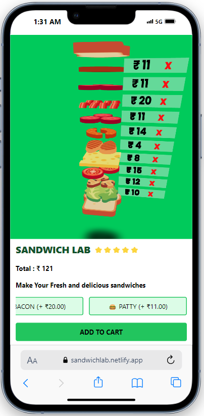

# THREE JS PROJECTS

## 1.Sandwich Lab

👉 [Live Demo](https://sandwichlab.netlify.app/)

## 2.3d Landing Page

👉 [Live Demo](https://threejs-responsive-website.netlify.app/)

<video controls src="2_Landing_Page/public/DemoVideo.mp4" title="Title"></video>

## 3.Three JS Website

👉 [Live Demo](https://threejs-graces-clone.netlify.app/)

<video controls src="3_Graces_Design_Clone/public/video.mp4" title="Title"></video>

[Offcial Website](https://threejs-graces.tiiny.site/)

## 4.Game Using The React Three Fiber And Rapier

👉 [Live Demo](https://r3fgame.netlify.app/)

<video controls src="5_Game/public/game.mp4" title="Title"></video>

## 5.Multiplayer Car Game using Playground

👉 [Live Demo](https://cscarroom.netlify.app/)

<video controls src="6_Multiplayer_Game_Lobby/public/Multiplayer.mp4" title="Title"></video>
